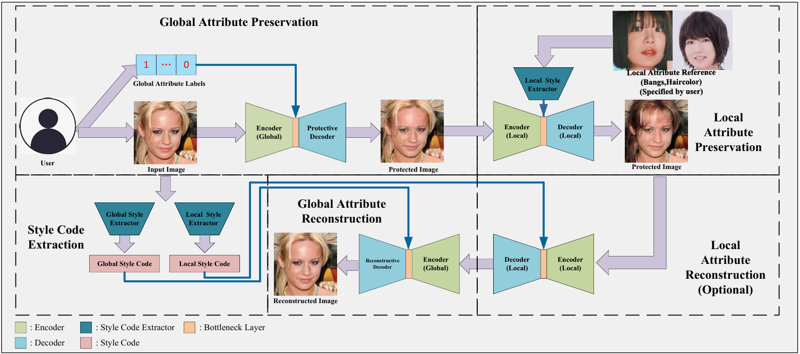

# Nagisa
This is the official code for paper Nagisa: A Reversible Privacy Preservation Scheme against Facial Soft-Biometric Attributes Recognition

The first author is a huge fans of Japanese singer Kuroki Nagisa, hence we select Nagisa as our schema's name.

The code will be released after it is sorted out

The code for Global attribute protection has been released

